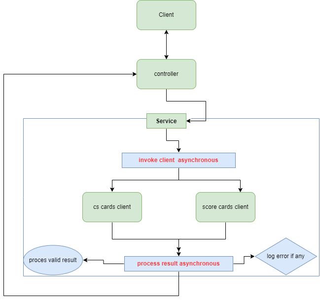

# Clear Score task

## How to run
* To run the application you can use one of these options:
  - open with idea of you choice and run `ClearScoreApplication`
  - run using maven `mvn spring-boot:run` default profile will be used
  - run using bash `start.sh` `./start.sh` local profile will be used with environment variables on `.env` file
  - you can change the environment variables on `.env`, if new key is add also add it on `application-local.properties`

## Design
* The service design follow the contract base implementation
* The swagger doc `microservice-swagger.json` provided is used to generate the contract for the service endpoint
* The api docs for third part providers is also used to generate models for the clients.
* All the swagger docs used for generated code are stored in `resources/swagger`
* `openapi-generator-maven-plugin` is used to generate the code mentioned above
* Service Flow    
* The project structure is as shown below:    
  
